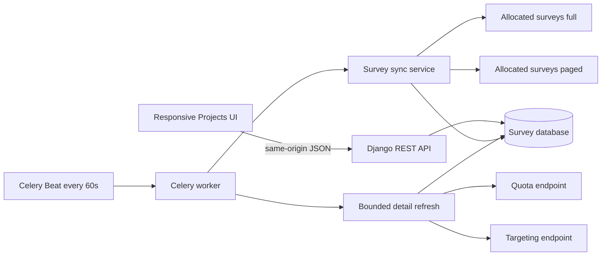

# Architecture

## Boundary and responsibilities

The browser talks only to same-origin Django endpoints. Django owns the InnovateMR token, outbound calls, normalization, merge decisions, IDs, persistence, filtering, and OpenAPI schema. Celery workers reuse the same service layer as the manual management command and internal sync endpoint.

## Data model

### `Survey`

One row per InnovateMR `surveyId`. `source_id` is unique. `local_id` is an immutable, indexed 14-digit public identifier. `company_name` identifies the supplier source and supports future multi-supplier filtering. Core inventory fields are normalized for filters and reporting while `raw_data` preserves the complete upstream payload for future fields and debugging.

`source_created_at` and `source_modified_at` retain upstream timestamps. `created_at` and `updated_at` are database audit timestamps. `last_seen_at` records inventory presence. A missing survey is marked `closed`, not deleted.

### `SurveyQuota`

Normalized quota metrics plus the original per-quota targeting JSON. Replacement is transactional: readers see either the previous complete set or the new complete set.

### `TargetingQuestion`

Question metadata and the upstream `Options` list. The options list intentionally remains JSON because age ranges, text answers, ZIP codes, and lookup-backed options are structurally different.

### `SyncRun`

Immutable operational history with endpoint counts, merged total, create/update/unchanged/closed counters, detail failures, status, timing and sanitized error text.

### `SurveyAttempt`

One record per respondent journey. RID is a random 10-character identifier and is supplied as both InnovateMR PID and `trackId`. The row connects survey and user ID, captures pre-screening answers, supplier code derived from the allocated entry link, initiation/submission/redirect/callback timestamps, initiation and callback IPs, callback count, terminal status and measured LOI. Browser callbacks are unverified until a trusted notification or hash confirms them.

### `LocalIdSequence`

One locked counter per `YYYYMM` prefix. New survey creation increments the counter in a database transaction and formats it as eight digits. InnovateMR updates never change this project ID.

## Merge rule

Both inventory sources are flattened into a map keyed by integer `surveyId`. For duplicate IDs, parsed `modifiedDate` is compared; if equal, the later source in the merge call wins. The service passes full inventory first and paged inventory second, making paged data the tie-breaker. An unparseable modified date falls back to `createdDate`, then the oldest UTC value.

The local row is updated when the incoming timestamp is newer, raw payload differs, or a closed survey becomes live again. Otherwise only `last_seen_at` changes.

## Scale decisions

Inventory ingestion never waits for two detail calls per survey. This matters for large initial imports. Detail refresh is a separately bounded minute job and is also demand-driven from the two row actions. Change detection uses `detail_synced_at < source_modified_at`.

For production volume, use PostgreSQL and Redis, run at least one dedicated worker for inventory and another for detail tasks, and monitor failed/retried Celery tasks plus `SyncRun.status`.

## Security

- The supplier token comes from process environment only and is sent in `x-access-token` over HTTPS.
- It is never serialized, rendered, logged intentionally, or stored in survey payloads.
- Raw upstream errors are kept server-side.
- Production should add organization authentication/authorization around UI and REST routes before exposing the service beyond a trusted network.
